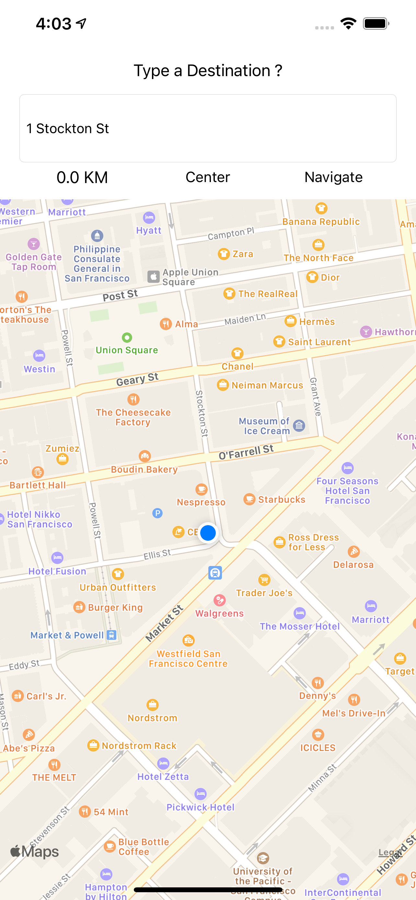
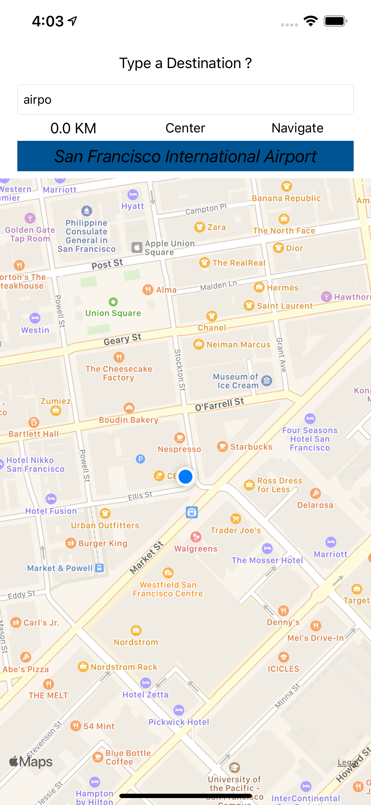
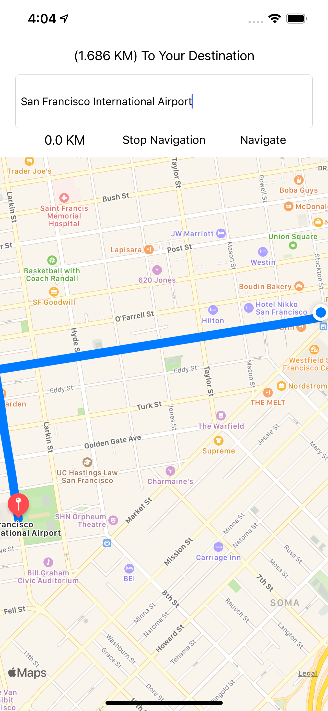
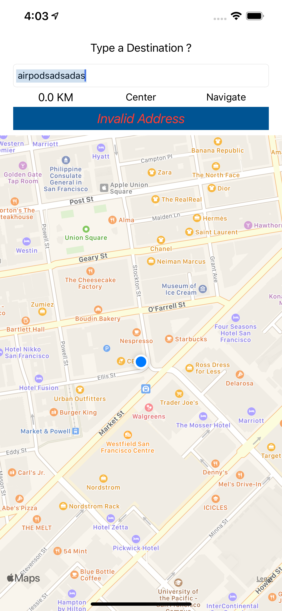
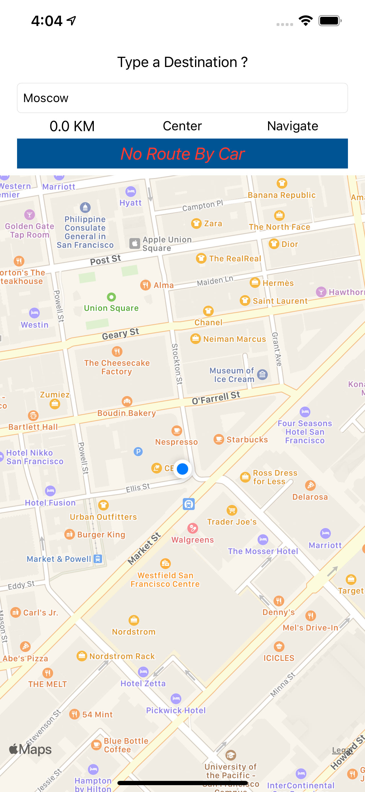

# DirectME APP
- Navigation App Built on Core Location & Mapkit on MVC Pattern.
- App is Created For Car Navigation Methods.
- Implementation of Speedometer , Real-Time Distance Tracker & Search Completer Handler.
- Project is completely written in Swift. 

## App Interface Samples.
<p>

</p>
<p>

</p>
<p>

</p>

## error Handling .
<p>

</p>
<p>

</p>
<p>

</p>

## Significant Code Lines .   
- Conversion String To CLLocationCoordinate2D. 

```swift
let geoAddrees = CLGeocoder()
        geoAddrees.geocodeAddressString(completerLabel.text ?? ""){ (lastPlace,error) in
            guard let myfinalDestination = lastPlace,
                  let lastLocation = myfinalDestination.first?.location?.coordinate else  {
                //in Case of Invalid Routing To Address
                self.completerLabel.text = "No Valid Address Or it's your location"
                self.completerLabel.textColor = .systemRed
                self.completerLabel.isHidden = false
                //Debug Purpose
                print("error getting address")
                return
            }
            
            //Pass Addresses for Routing Proccess
            self.routingProccess(currentLocation: initialPlace, destinationPlace: lastLocation)
            
            //Pass Lastlocation For Pin Mark
            self.setAnnotationPinTo(lastLocation)
}

```

- Distance Calculation Between Two CLLocationCoordinate2D Coordinations. 

```swift
//Calculate Distance Func
        func distance(from: CLLocationCoordinate2D, to: CLLocationCoordinate2D) {
            let from = CLLocation(latitude: from.latitude, longitude: from.longitude) //get First Coordination
            let to = CLLocation(latitude: to.latitude, longitude: to.longitude)       //get Second Coordination
            let distanceVal = from.distance(from: to)            
            self.addressLabel.text = String(format: "Remains: %.2f KM ", (distanceVal/1000))
        }
```
- Real Time Tracking Location On Screen  

```swift
//Track Real-time Navigation Usr Location on Screen
        let centerLocation    = CLLocationCoordinate2DMake(location.coordinate.latitude, location.coordinate.longitude)
        let centerLocationView = MKCoordinateRegion.init(center: centerLocation, latitudinalMeters: 500, longitudinalMeters: 500)
        myMAp.setRegion(centerLocationView, animated: true)
```
- MKDirections Function.
```swift 
//Routing Function
    func routingProccess(currentLocation:CLLocationCoordinate2D , destinationPlace:CLLocationCoordinate2D){
        //MapKit DirectionRquest
        let directionsRequest = MKDirections.Request()
        
        //Get Initial Addres & Address to Go
        directionsRequest.source = MKMapItem(placemark: MKPlacemark(coordinate: currentLocation, addressDictionary: nil))
        directionsRequest.destination = MKMapItem(placemark: MKPlacemark(coordinate: destinationPlace, addressDictionary: nil))
        directionsRequest.requestsAlternateRoutes = true
        directionsRequest.transportType = .automobile
        
        let directionsShow = MKDirections(request: directionsRequest)
        
        //Routing Addresses
        directionsShow.calculate(completionHandler: {(response,error)->Void in
            guard let getResponse = response else {
               
                //in Case of Invalid Routing To Address
                self.completerLabel.text = "No Route By Car"
                self.completerLabel.textColor = .systemRed
                self.completerLabel.isHidden = false
                // Disable User Interaction
                self.completerLabel.isUserInteractionEnabled = false
                
                //No Routing
                print ("error addressing")
                return
            }
            
            //Show Route between User Location & Destination Address
            if let route = getResponse.routes.first {
                self.myMAp.addOverlay(route.polyline)
                let rect = route.polyline.boundingMapRect
                self.myMAp.setRegion(MKCoordinateRegion(rect), animated: true)
            }
            
            //Set New Title For Center Button
            self.centerLabel.setTitle("Stop Navigation", for: .normal)
            
            //Distance Calculation
            let distance = getResponse.routes.first!.distance
            self.addressLabel.text = "(\(distance/1000) KM) To Your Destination"
            print("\(distance/1000) KM")
            
        })
    }
```
